# 英雄聯盟小助手
## 使用說明
1. Install package ( python version = 3.8 )
```
pip install -r requirements.txt
``` 
2. Deploy locally
```shell
ngrok http 8000
python app.py
```
2. Modify .env
```shell
LINE_CHANNEL_SECRET=1190fcbb2fe2efe76e23195b65232db9
LINE_CHANNEL_ACCESS_TOKEN=5MhD/9lo3NAxUWWvzv7c+naAeApMs/AWDAft+iMU2CMXH+N94LG1UK5x9+xFiCHWiNx+6/G1h85Q9LbCVms4XzGJ4LVJU8g81EN2toZDZcFYIgFKqYjHCh4eD8wQAoKKovq86W19h581vdi5fKobsgdB04t89/1O/w1cDnyilFU=
PORT=8000
WEB_URL=https://5eab-2001-b011-e00a-1b7e-ec22-2194-e954-fc16.jp.ngrok.io
```
## 執行成果
### 初始歡迎訊息
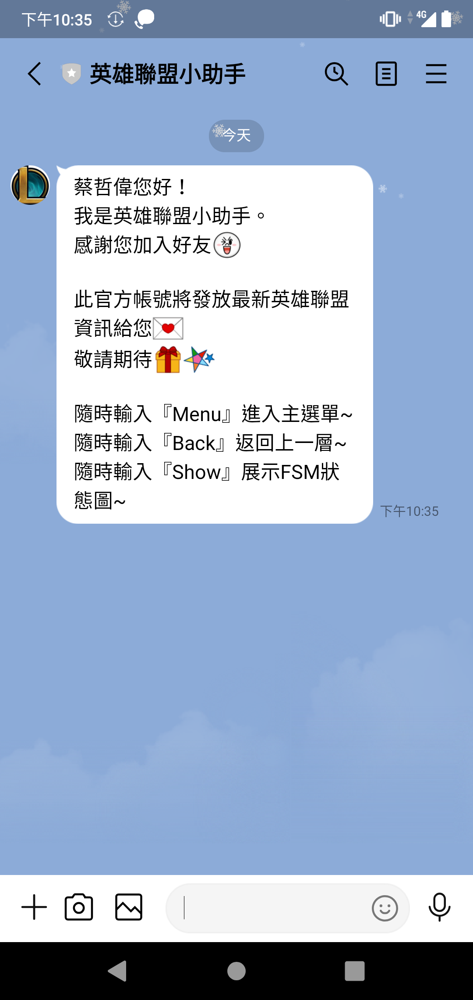  
  
### 主選單
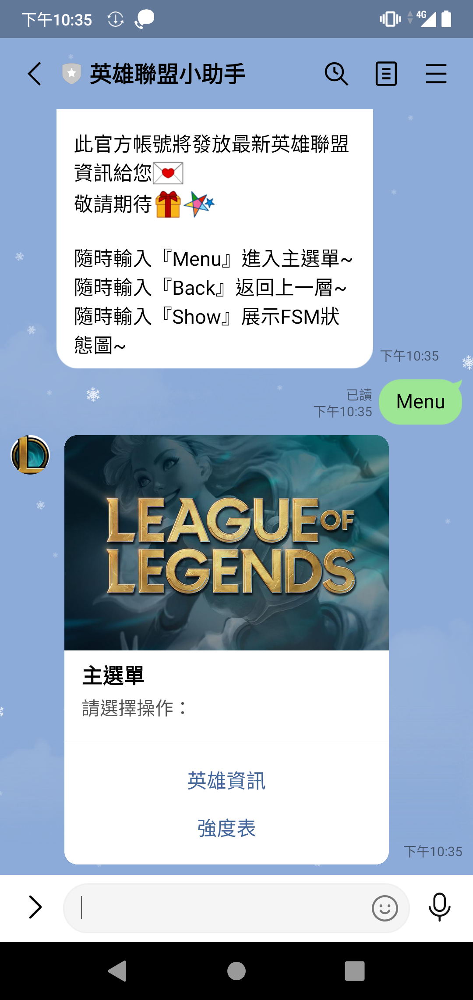  
  
### 查詢名稱(可模糊化查詢)
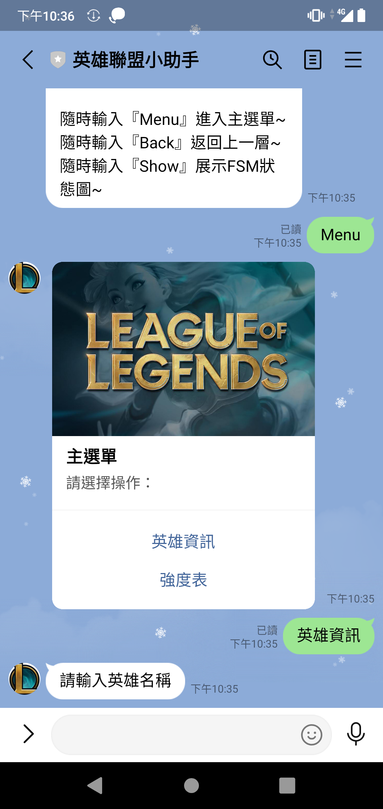  
  
### 選擇位置
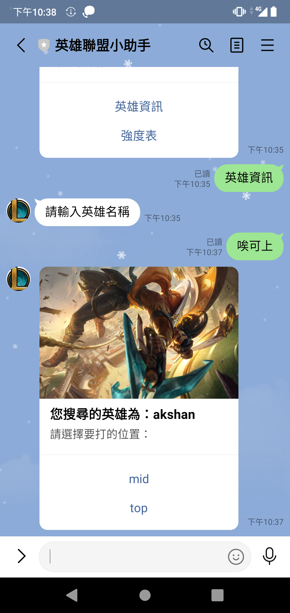  
  
### 選擇構築or克制
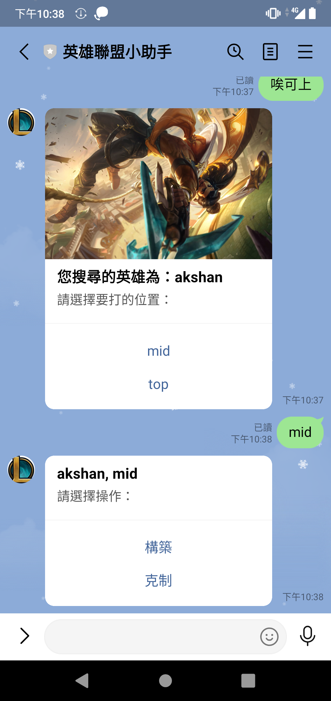  
  
### 構築：出裝、符文、技能點法
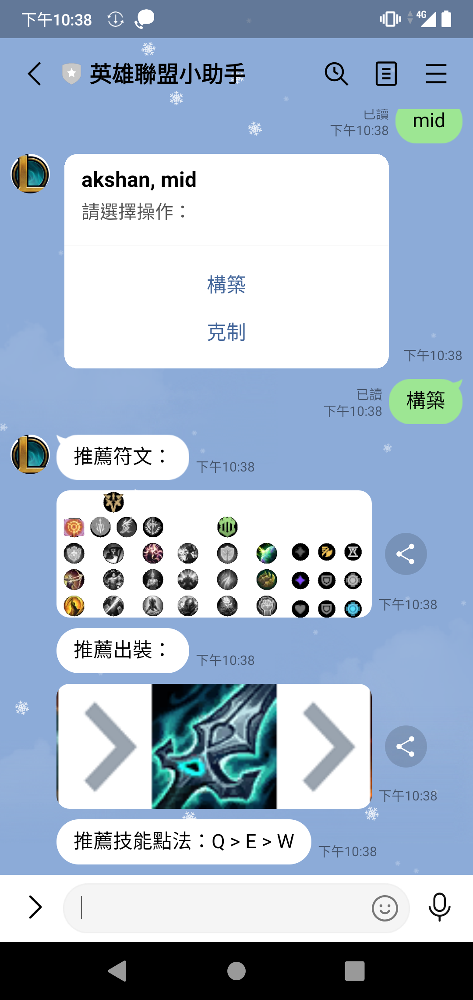  
  
### 返回
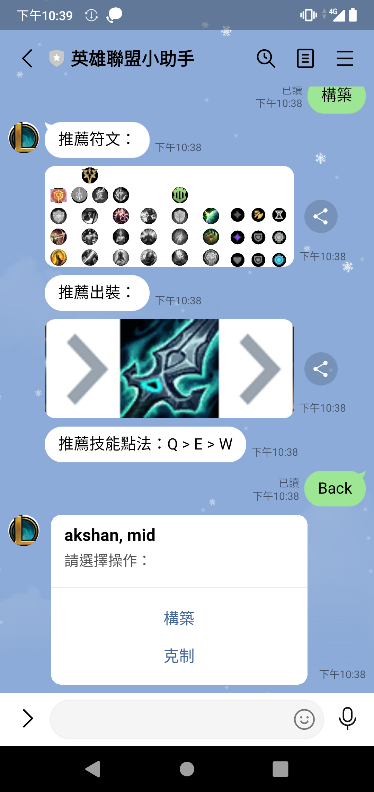  
  
### 查看克制關係
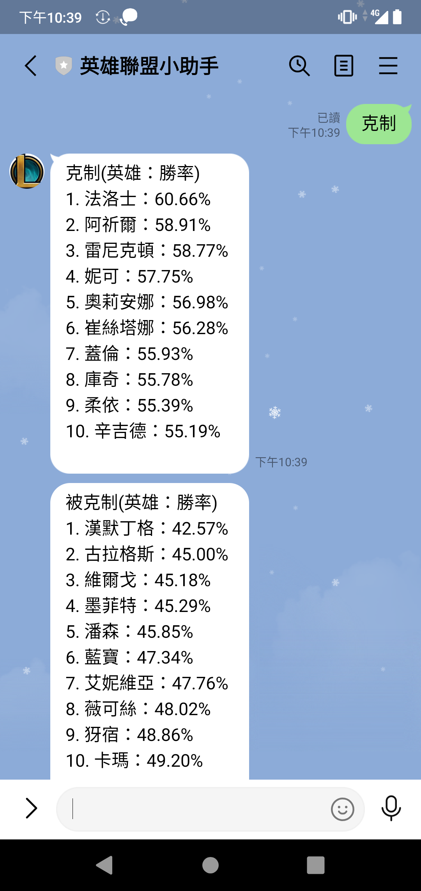  
  
### 回到主畫面
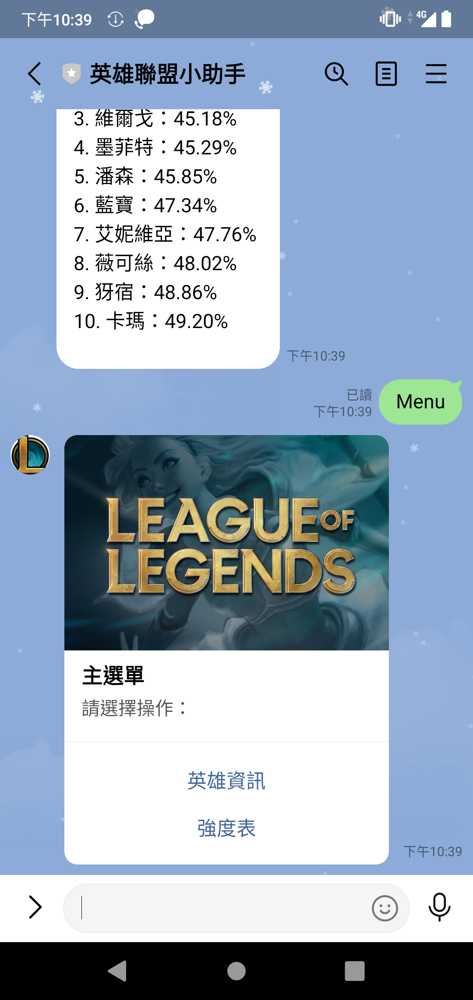  
  
### 英雄強度表
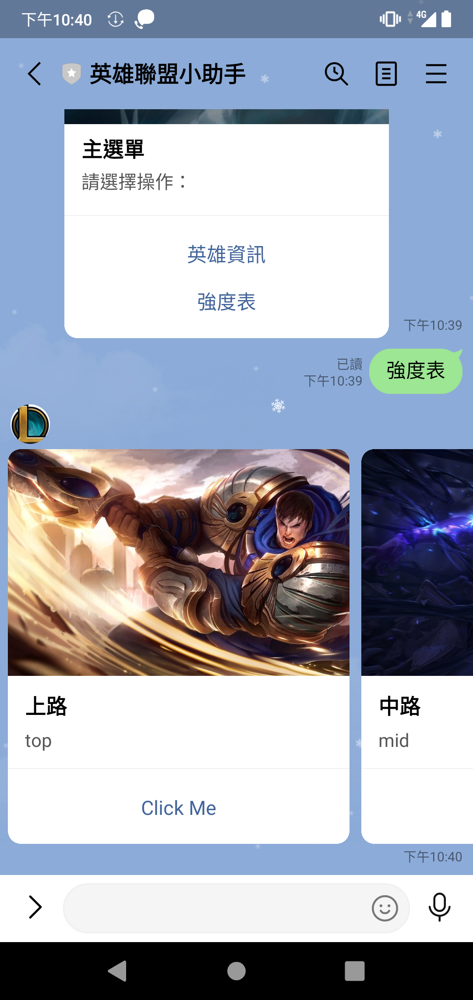  
  
### 選擇位置
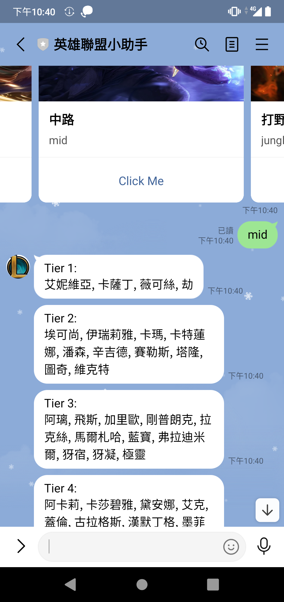  
  
### 展示fsm
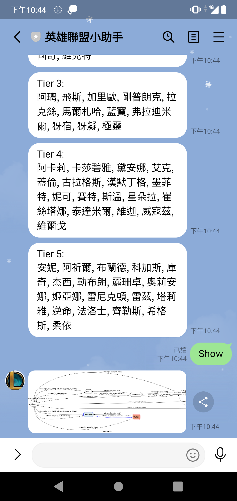  
  
### fsm
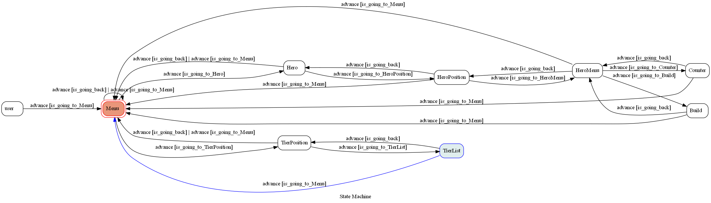
